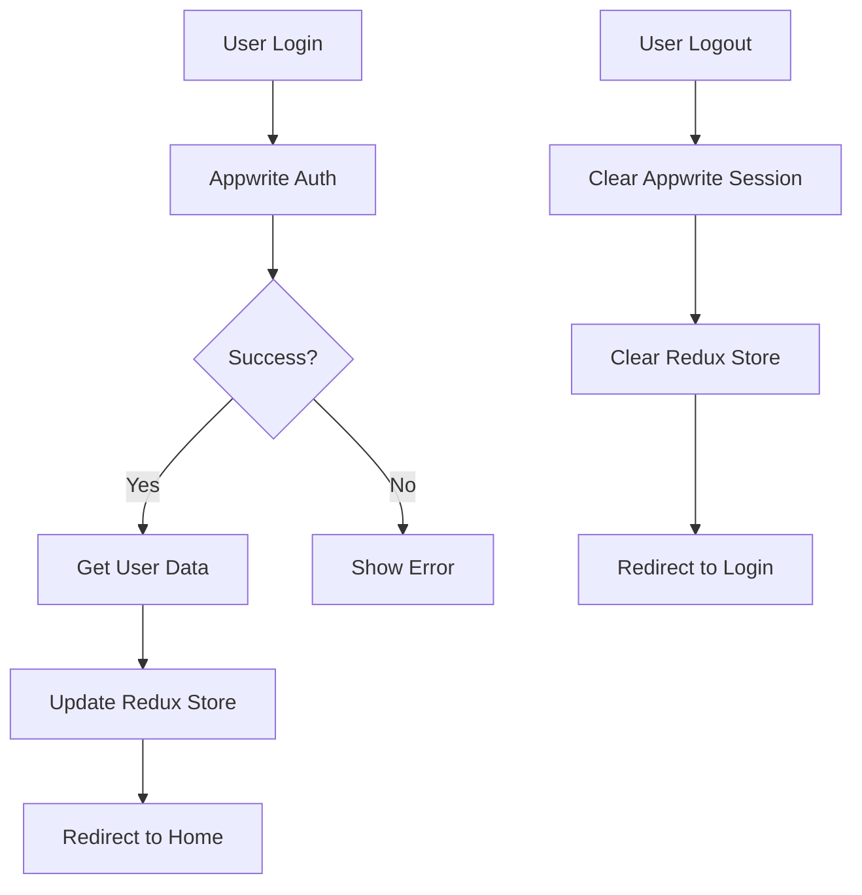
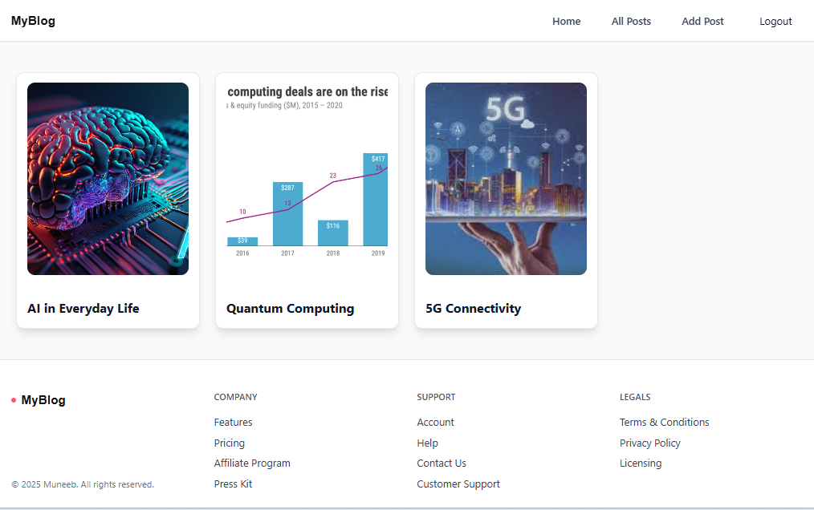
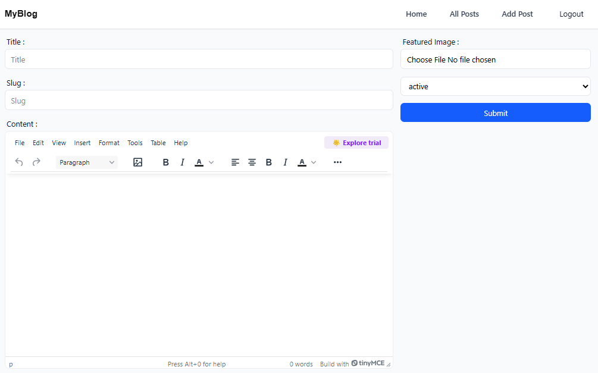

# 📝 Modern Blog Application

A full-featured blog platform built with **React**, **Redux Toolkit**, and **Appwrite** backend services. This application demonstrates modern web development practices including authentication, CRUD operations, rich text editing, and responsive design.


## 🚀 Live Demo

[View Live Application](https://modern-blog-platform-snowy.vercel.app/)

## 📋 Table of Contents

- [Features](#-features)
- [Technology Stack](#-technology-stack)
- [Architecture Overview](#-architecture-overview)
- [Getting Started](#-getting-started)
- [Project Structure](#-project-structure)
- [Key Components](#-key-components)
- [State Management](#-state-management)
- [Authentication Flow](#-authentication-flow)
- [Backend Integration](#-backend-integration)
- [Screenshots](#-screenshots)
- [Challenges & Solutions](#-challenges--solutions)
- [Future Enhancements](#-future-enhancements)
- [Contributing](#-contributing)

## ✨ Features

### 🔐 Authentication & Authorization

- **Secure user registration and login** with email/password
- **Protected routes** with authentication guards
- **Session persistence** across browser refreshes
- **User-specific content** with ownership validation
- **Automatic logout** on session expiry

### 📰 Content Management

- **Rich text editor** with TinyMCE integration
- **Image upload and management** with preview functionality
- **CRUD operations** - Create, Read, Update, Delete posts
- **Draft/Published status** management
- **URL slug generation** from post titles
- **Responsive post cards** with optimized images

### 🎨 User Experience

- **Responsive design** that works on all devices
- **Modern UI** with Tailwind CSS styling
- **Loading states** and error handling
- **Smooth navigation** with React Router
- **Real-time updates** without page refreshes

### 🔒 Security Features

- **Role-based permissions** (only authors can edit/delete their posts)
- **Protected file uploads** with type validation
- **XSS protection** with HTML sanitization
- **Secure API communication** with Appwrite SDK

## 🛠 Technology Stack

### Frontend

- **React 18** - Modern React with hooks and functional components
- **Redux Toolkit** - Efficient state management with simplified syntax
- **React Router DOM** - Client-side routing and navigation
- **React Hook Form** - Performant forms with minimal re-renders
- **TinyMCE** - Professional rich text editor
- **Tailwind CSS** - Utility-first CSS framework

### Backend as a Service

- **Appwrite** - Open-source backend server
  - Authentication service
  - Database (NoSQL document-based)
  - File storage and management
  - Real-time subscriptions
  - Role-based permissions

### Development Tools

- **Vite** - Fast build tool and dev server
- **ESLint** - Code linting and formatting
- **Environment Variables** - Secure configuration management

## 🏗 Architecture Overview

```
┌─────────────────┐    ┌──────────────────┐    ┌─────────────────┐
│   React App     │    │   Redux Store    │    │   Appwrite      │
│                 │    │                  │    │   Backend       │
│ ┌─────────────┐ │    │ ┌──────────────┐ │    │ ┌─────────────┐ │
│ │ Components  │◄┼────┼►│ Auth Slice   │ │    │ │ Auth Service│ │
│ │ Pages       │ │    │ │ (User State) │ │    │ │ Database    │ │
│ │ Services    │ │    │ └──────────────┘ │    │ │ Storage     │ │
│ └─────────────┘ │    └──────────────────┘    │ └─────────────┘ │
└─────────────────┘                            └─────────────────┘
```

### Key Architectural Decisions

1. **Component Composition**: Reusable UI components with consistent interfaces
2. **Service Layer Pattern**: Separate business logic from UI components
3. **Redux for Global State**: Centralized state management for user authentication
4. **Protected Routes**: Authentication guards for secure page access
5. **Error Boundaries**: Graceful error handling and user feedback

## 🚀 Getting Started

### Prerequisites

- Node.js 16+ and npm/yarn
- Appwrite server instance (cloud or self-hosted)

### Installation

1. **Clone the repository**

   ```bash
   git clone https://github.com/yourusername/blog-app.git
   cd blog-app
   ```

2. **Install dependencies**

   ```bash
   npm install
   ```

3. **Environment Configuration**

   Create a `.env` file in the root directory:

   ```env
   VITE_APPWRITE_URL=https://your-appwrite-endpoint
   VITE_APPWRITE_PROJECT_ID=your-project-id
   VITE_APPWRITE_DATABASE_ID=your-database-id
   VITE_APPWRITE_COLLECTION_ID=your-collection-id
   VITE_APPWRITE_BUCKET_ID=your-bucket-id
   ```

4. **Appwrite Setup**

   - Create a new Appwrite project
   - Set up authentication (email/password)
   - Create a database and collection with these attributes:
     ```
     title: string
     content: string
     featuredImage: string
     status: string
     userID: string
     ```
   - Create a storage bucket for images
   - Configure permissions for read/write access

5. **Start the development server**
   ```bash
   npm run dev
   ```

## 📁 Project Structure

```
src/
├── appwrite/           # Backend service configuration
│   ├── auth.js        # Authentication service
│   └── config.js      # Database & storage operations
├── components/         # Reusable UI components
│   ├── Container/     # Layout wrapper
│   ├── Header/        # Navigation header
│   ├── Footer/        # Site footer
│   ├── post-form/     # Post creation/editing form
│   ├── AuthLayout.jsx # Route protection wrapper
│   ├── Button.jsx     # Custom button component
│   ├── Input.jsx      # Form input component
│   ├── Login.jsx      # Login form
│   ├── PostCard.jsx   # Post preview card
│   ├── RTE.jsx        # Rich text editor
│   ├── Select.jsx     # Dropdown select
│   └── Signup.jsx     # Registration form
├── conf/              # Configuration
│   └── conf.js        # Environment variables
├── pages/             # Page components
│   ├── AddPost.jsx    # Create new post
│   ├── EditPost.jsx   # Edit existing post
│   ├── Home.jsx       # Homepage with post grid
│   ├── Login.jsx      # Login page
│   ├── Post.jsx       # Individual post view
│   └── Signup.jsx     # Registration page
├── store/             # Redux configuration
│   ├── authSlice.js   # Authentication state
│   └── store.js       # Store configuration
├── App.jsx            # Main app component
├── main.jsx           # App entry point
└── index.css          # Global styles
```

## 🧩 Key Components

### 1. Authentication System

**AuthLayout.jsx** - Protected Route Wrapper

```javascript
// Protects routes based on authentication status
export default function Protected({ children, authentication = true }) {
  const authStatus = useSelector((state) => state.auth.status);

  useEffect(() => {
    if (authentication && authStatus !== authentication) {
      navigate("/login");
    } else if (!authentication && authStatus !== authentication) {
      navigate("/");
    }
  }, [authStatus, navigate, authentication]);

  return loader ? <h1>Loading...</h1> : <>{children}</>;
}
```

### 2. Rich Text Editor (RTE.jsx)

**TinyMCE Integration** with React Hook Form

```javascript
<Controller
  name={name || "content"}
  control={control}
  render={({ field: { onChange } }) => (
    <Editor
      apiKey="your-tinymce-api-key"
      initialValue={defaultValue}
      init={{
        height: 500,
        plugins: ["image", "link", "lists", "code", "table"],
        toolbar:
          "undo redo | bold italic | alignleft aligncenter | bullist numlist",
      }}
      onEditorChange={onChange}
    />
  )}
/>
```

### 3. Dynamic Post Form (PostForm.jsx)

**Handles both Create and Edit operations**

- Form validation with React Hook Form
- Image upload with preview
- Automatic slug generation from titles
- Status management (draft/published)

### 4. Responsive Post Cards

**Modern grid layout** with hover effects and optimized images

```javascript
<div className="grid grid-cols-1 sm:grid-cols-2 md:grid-cols-3 lg:grid-cols-4 gap-6">
  {posts.map((post) => (
    <PostCard key={post.$id} {...post} />
  ))}
</div>
```

## 🗃 State Management

### Redux Toolkit Implementation

**Auth Slice** - Manages user authentication state

```javascript
const authSlice = createSlice({
  name: "auth",
  initialState: { status: false, userData: null },
  reducers: {
    login: (state, action) => {
      state.status = true;
      state.userData = action.payload;
    },
    logout: (state) => {
      state.status = false;
      state.userData = null;
    },
  },
});
```

**Store Configuration**

```javascript
const store = configureStore({
  reducer: {
    auth: authSlice,
    // TODO: add posts slice for better state management
  },
});
```

## 🔐 Authentication Flow



### Authentication Features:

- **Session Management**: Persistent login across browser sessions
- **Route Protection**: Automatic redirects for unauthorized access
- **User Context**: Global user state available throughout the app
- **Secure Logout**: Complete session cleanup

## 🔌 Backend Integration

### Appwrite Services

**Authentication Service (auth.js)**

```javascript
class AuthService {
  async createAccount({ email, password, name }) {
    const userAccount = await this.account.create(
      ID.unique(),
      email,
      password,
      name
    );
    return userAccount ? this.login({ email, password }) : userAccount;
  }

  async getCurrentUser() {
    return await this.account.get();
  }
}
```

**Database Service (config.js)**

```javascript
class Service {
  async createPost({ title, content, featuredImage, status, userID }) {
    return await this.databases.createDocument(
      conf.appwriteDatabaseId,
      conf.appwriteCollectionId,
      slug,
      { title, content, featuredImage, status, userID },
      [
        Permission.read(Role.any()),
        Permission.update(Role.user(userID)),
        Permission.delete(Role.user(userID)),
      ]
    );
  }
}
```

### Security Implementation

- **Role-based Permissions**: Users can only edit/delete their own posts
- **File Upload Validation**: Type checking for image uploads
- **Query Filtering**: Only active posts shown to users
- **Session Validation**: Automatic logout on expired sessions

## 🎯 Challenges & Solutions

### 1. **Authentication State Synchronization**

**Problem**: Edit/Delete buttons not appearing immediately after login
**Solution**: Implemented proper Redux state management with `useEffect` dependencies

```javascript
useEffect(() => {
  if (post && userData) {
    setIsAuthor(post.userID === userData.$id);
  }
}, [post, userData]);
```

### 2. **Post Visibility After Logout**

**Problem**: Cached posts still visible after logout
**Solution**: Clear posts when authentication status changes

```javascript
useEffect(() => {
  if (authStatus) {
    appwriteService.getPosts().then(setPosts);
  } else {
    setPosts([]);
  }
}, [authStatus]);
```

### 3. **Redux Payload Structure**

**Problem**: Mismatch between dispatched data and expected payload structure
**Solution**: Aligned action creators with reducer expectations

```javascript
// Fixed: Direct payload access
state.userData = action.payload; // Instead of action.payload.userData
```

### 4. **Rich Text Editor Integration**

**Problem**: Complex form state management with WYSIWYG editor
**Solution**: Used React Hook Form Controller for seamless integration

## 📱 Screenshots

### Homepage


_Responsive grid layout with post cards_

### Post Editor


_Rich text editor with image upload_

### Individual Post


_Post view with edit/delete controls for authors_

## 🔮 Future Enhancements

### Planned Features

- [ ] **Comment System** - User interactions and discussions
- [ ] **Post Categories & Tags** - Better content organization
- [ ] **Search Functionality** - Full-text search across posts
- [ ] **User Profiles** - Author pages and bio information
- [ ] **Social Sharing** - Share posts on social platforms
- [ ] **Email Notifications** - Updates for followers
- [ ] **Dark Mode** - Theme switching capability
- [ ] **SEO Optimization** - Meta tags and structured data
- [ ] **Analytics Dashboard** - Post performance metrics
- [ ] **Mobile App** - React Native version

### Technical Improvements

- [ ] **Posts Redux Slice** - Better state management for posts
- [ ] **Infinite Scrolling** - Paginated post loading
- [ ] **Image Optimization** - WebP conversion and lazy loading
- [ ] **PWA Features** - Offline reading capability
- [ ] **Performance Monitoring** - Error tracking and analytics
- [ ] **Automated Testing** - Unit and integration tests
- [ ] **CI/CD Pipeline** - Automated deployment

## 🤝 Contributing

Contributions are welcome! Please feel free to submit a Pull Request.

### Development Guidelines

1. Follow the existing code style and structure
2. Add comments for complex logic
3. Test your changes thoroughly
4. Update documentation as needed

### Getting Started with Development

1. Fork the repository
2. Create a feature branch: `git checkout -b feature-name`
3. Make your changes and commit: `git commit -m 'Add feature'`
4. Push to the branch: `git push origin feature-name`
5. Submit a pull request

## 📄 License

This project is licensed under the MIT License - see the [LICENSE](LICENSE) file for details.

## 👤 Author

**Your Name**

- GitHub: [Muhammad Muneeb Alam](https://github.com/M-MuneebAlam)
- LinkedIn: [Muneeb Alam](https://www.linkedin.com/in/muneeb-alam-203014161/)

## 🙏 Acknowledgments

- [Appwrite](https://appwrite.io/) - Backend-as-a-Service platform
- [TinyMCE](https://www.tiny.cloud/) - Rich text editor
- [Tailwind CSS](https://tailwindcss.com/) - CSS framework
- [React Hook Form](https://react-hook-form.com/) - Form library

---

⭐ **Star this repository if you found it helpful!**

_Built with ❤️ using modern web technologies_
